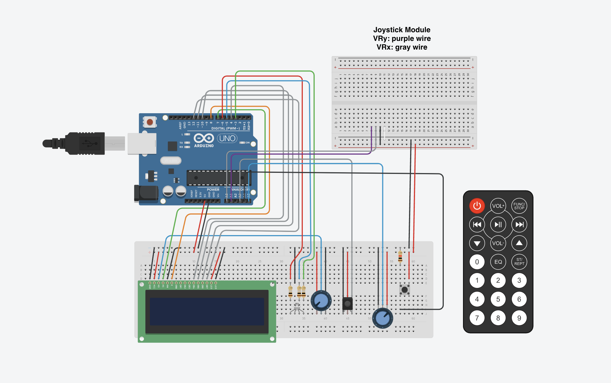

# Do-it: AVR Microcontroller Bop-it Remake
**Davis Kim**  
**August 2024**

---

## Introduction
**"Do-it"** is a single-player reaction game inspired by the classic *Bop-it* game. The user is prompted to start the game using an IR remote. The game counts down and provides random commands to the player, such as pressing a button, moving a joystick, or twisting a knob. If the player successfully completes the command within the time limit, their score increases. The game continues until the player fails to perform the correct action, at which point they can reset the game at any time using the IR remote.

### Key Features:
- User actions: Button press, joystick movement, potentiometer twist.
- Random action prompts with a countdown.
- Score tracking and real-time feedback via an RGB LED and an LCD screen.
- Reset functionality for restarting the game.

---

## Hardware Components Used

### Computing:
- **Elegoo UNO R3 microcontroller** (based on the ATmega328)

### Inputs:
- **IR Remote**: To start the game and reset it.
- **IR Receiver module**: To detect signals from the remote.
- **Push Button**: One of the player's inputs for game actions.
- **Joystick Module**: Allows the player to move in various directions.
- **Potentiometer**: Used as a twisting input by the player.

### Outputs:
- **RGB LED**: Provides visual feedback for success (green) and failure (red), as well as for game resetting (white).
- **LCD1602 Module**: Displays instructions, feedback, and the player's score.

### Miscellaneous:
- **Resistors**: To control current through the components.
- **820 Tie-Points Breadboard**: For connecting components.
- **Breadboard jumper wires**: To connect various components together.

---

## Software Libraries Used

- **`timer.h`**: Used to implement time periods and control the flow of the game.
- **`LiquidCrystal`**: Communicates with the LCD screen to display messages.
- **`IRremote`**: Decodes signals from the IR remote to trigger various game actions.
- **`util/delay`**: Provides precise time delays for countdowns and feedback.

---

## User Guide

1. **Starting the Game**:
   - After powering the system, the LCD screen will display: "Press 0 to start."
   - Press "0" on the IR remote to begin the game.

2. **Gameplay**:
   - The game will count down and then prompt the player to perform one of three actions:
     - "Press the button."
     - "Move the joystick."
     - "Twist the knob."
   - Successfully completing the action increases the player's score by 1.
   - The screen will display "Success," and the RGB LED will light up green for confirmation.

3. **Game Over**:
   - If the player fails to perform the correct action, the game ends.
   - The screen displays "Game Over" and shows the player's score, while the RGB LED lights up red.

4. **Resetting the Game**:
   - The player can reset the game at any time by pressing "1" on the IR remote.
   - The system will reset, and the RGB LED will flash white while the LCD displays "Game Resetting."
     
---

## Extra Componenets

- **LCD1602 Display**: Displays real-time game instructions and feedback.
- **IR Receiver**: Detects input from the IR remote to control game flow.
- **Joystick Module**: Allows directional inputs for gameplay.
- **Potentiometer**: Used for the "twist" action in the game.

---

## Wiring Diagram

The wiring diagram shows the connections between the Elegoo UNO R3, LCD1602 display, RGB LED, joystick module, push button, and potentiometer. Each component is connected via the breadboard with jumper wires and resistors to control the current.

---

## Future Work
- **Expand Game Modes**: Introduce difficulty levels or additional input options.
- **Implement DHT11 Sensor**: Use temperature and humidity data to alter gameplay.
- **Add EEPROM**: Store high scores and player progress between sessions.
- **Improve RGB Lighting**: Implement a full RGB color range for more diverse feedback.

---

## Conclusion
*Do-it* is a fun and interactive reaction-based game that challenges players to respond quickly to random prompts. With the successful integration of multiple input devices and real-time feedback, the project demonstrates the effective use of embedded systems in game development. Future iterations could include additional features such as new game modes, high-score tracking, and expanded input options.

---

### Author
**Davis Kim**  
Computer Science and Engineering  
University of California, Riverside  
*Project Date: August 2024*
